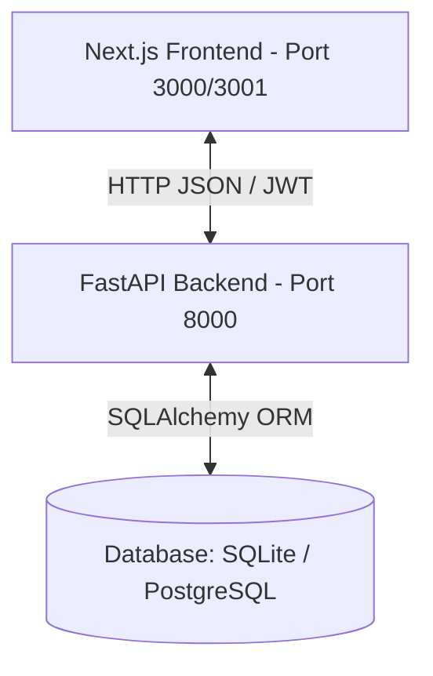

# POD--Flik: 1Cell.AI Inventory Tracking System

A full-stack laboratory inventory tracking and order management system built with a FastAPI backend and a Next.js (TypeScript) frontend.

---

##  Architecture Overview

The project uses a decoupled Client-Server architecture. The frontend is a single-page style Next.js application that communicates entirely via JSON APIs with a FastAPI server.



- **Frontend**: Serves the user interface, manages state locally in React, and consumes the backend REST endpoints.
- **Backend**: Processes business logic, handles security & authentication (JWT + bcrypt), and executes database operations.
- **Database**: Stores inventory items, categories/brands, order history, audit logs, and users.

---

##  Backend (FastAPI)

The backend is built using **Python 3** and **FastAPI** (`backend/main.py`), optimized for high-performance and asynchronous task handling.

### Key Components
- **API Framework**: FastAPI provides automatic OpenAPI interactive documentation (available at `/docs`) and Pydantic schema validation.
- **ORM & Migrations**: SQLAlchemy is used as the Object-Relational Mapper (`models.py`) with Alembic handles database migrations.
- **Authentication**: JWT authentication tokens generated with `python-jose` using HMAC SHA-256 signatures (`auth.py`). Passwords are securely hashed using `bcrypt` (via `argon2-cffi`/`pwdlib` integrations).

---

##  Database Connection

The database configuration is managed dynamically in `backend/database.py`.

### 1. Connection String Resolution
The backend queries the `DATABASE_URL` environment variable. If it's not set, it defaults to a local SQLite database file:
```python
DATABASE_URL = os.getenv("DATABASE_URL", "sqlite:///./inventory.db")
```

### 2. Auto-Initialization
When running in development, the database schema is automatically checked and created on application startup without requiring manual migration steps:
```python
models.Base.metadata.create_all(bind=engine)
```

### 3. Drivers
- **SQLite**: Zero-config file-based DB, configured with `check_same_thread=False` for concurrent API handling.
- **PostgreSQL**: Production-ready support enabled via the `psycopg2-binary` driver. The engine automatically normalizes legacy `postgres://` connection strings to SQLAlchemy's expected `postgresql://` protocol.

---

##  Frontend (Next.js & TypeScript)

The frontend is a modern Next.js project designed with responsive styling and robust type definitions.

### Key Components
- **Framework**: Next.js 16 (using the App Router structure `app/page.tsx`) with React 19.
- **Type Safety**: Full TypeScript integration for inventory types, user roles, comments, and order records (`types/inventory.ts`).
- **Styling**: Built on modern styling tokens using Vanilla CSS (`app/globals.css` and custom components) alongside Tailwind CSS.
- **Views**: A client-side view router dynamically mounts dashboards, stock lists, orders, audit logs, and user admin views based on the logged-in user's roles.

---

##  Frontend-Backend Connection

The bridge between the client and server is defined in `frontend/lib/api.ts`.

### 1. API Client Configuration
The frontend automatically resolves the server location using the `NEXT_PUBLIC_API_BASE_URL` environment variable, defaulting to `http://127.0.0.1:8000`:
```typescript
const API_BASE_URL = (
  process.env.NEXT_PUBLIC_API_BASE_URL ?? "http://127.0.0.1:8000"
).replace(/\/$/, "");
```

### 2. Authentication Flow
1. The user logs in via the login form, sending credentials to `/login`.
2. The server responds with a JWT `access_token`.
3. The frontend stores this token in state and attaches it to the HTTP headers of all subsequent API calls:
   ```typescript
   Authorization: Bearer <token>
   ```

---

##  Running the Application Locally

### Prerequisite
Ensure you have **Python 3.10+** and **Node.js 18+** installed.

### 1. Start Backend
Navigate to the backend directory, set up your virtual environment, install packages, and launch:
```bash
cd backend
python3 -m venv .venv
source .venv/bin/activate  # Or .venv\Scripts\activate on Windows
pip install -r requirements.txt
uvicorn main:app --reload
```
The server will start on `http://127.0.0.1:8000`.

### 2. Register the Admin Account
Since the SQLite database is empty on first startup, the first user registered is automatically granted the **Admin** role. Create your account:
```bash
curl -X POST http://127.0.0.1:8000/register \
  -H "Content-Type: application/json" \
  -d '{"username": "admin", "password": "yourpassword"}'
```

### 3. Start Frontend
In a new terminal window, navigate to the frontend directory, install packages, and start:
```bash
cd frontend
npm install
npm run dev
```
The app will open on `http://localhost:3000` (or `http://localhost:3001` if port 3000 is occupied). Log in using the admin account created in step 2.
